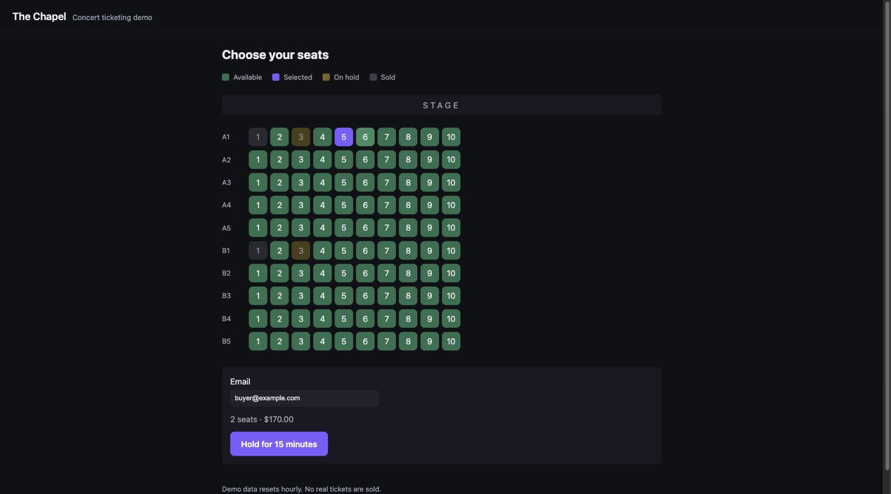

# The Chapel — Concert Ticketing

[](https://github.com/evanpowell/concert-ticketing/actions/workflows/ci.yml)

A seat-booking application built on **Angular · ASP.NET Core · Oracle**, written to
solve one problem properly: two people clicking the same seat at the same instant.



---

## Why ticketing

Most portfolio projects are CRUD with a coat of paint — there is no way to tell a
careful implementation from a careless one. Seat booking has a genuine concurrency
problem that cannot be faked: either the system sells the same seat twice or it
doesn't, and the difference is visible, testable, and worth arguing about.

Everything here exists to make that problem real and then solve it.

## Try it

```bash
docker compose up
```

Then open **http://localhost:8080**.

That's the whole setup. The stack reaches healthy in about 10 seconds once images
are pulled, creates its own schema, and seeds three shows with 100 seats each.
First run pulls the Oracle image, which is roughly 4.8 GB.

| | |
|---|---|
| `/` | The buyer flow |
| `/docs` | Interactive API reference — you can execute requests against live Oracle |
| `/health` | Liveness plus a database probe |

**To see the point of the project:** open the same show in two browser windows
side by side. Hold a seat in one. Within three seconds it turns amber in the
other, untouched. That is a database row lock made visible.

---

## The interesting part

The sellable unit is a `SHOW_SEAT` — the intersection of a show and a physical
seat. That row is the unit of inventory, and it is the row that gets locked.

### The hold transaction

```sql
SELECT show_seat_id, status, expires_at, price_cents
  FROM show_seat
 WHERE show_id = :showId
   AND seat_id IN (:seatIds)
 ORDER BY show_seat_id
   FOR UPDATE NOWAIT;
```

`FOR UPDATE` takes pessimistic row locks. A second transaction touching those rows
cannot proceed.

### Why `NOWAIT` rather than waiting

`NOWAIT` makes a contending transaction fail immediately with `ORA-00054` instead
of queueing. Two reasons, and the second is the one I'd lead with in conversation:

1. **Responsiveness.** The user gets an answer in milliseconds rather than blocking
   on a lock held by a stranger who may be gone.
2. **Deadlock becomes structurally impossible.** A multi-seat hold locks several
   rows at once, which is exactly the shape that deadlocks. But no transaction ever
   *waits* for a lock, so no cycle of waits can form. The deadlock isn't handled —
   it cannot occur.

`ORA-00054` maps to **409 Conflict**.

### Hold expiry is evaluated twice, deliberately

Holds last 15 minutes. The naive design has a background job flip expired holds
back to `AVAILABLE` and everything else read `status`. That is racy: there is
always a window where a hold has expired but has not yet been swept.

So expiry is evaluated two ways:

- **Authoritatively, inside the lock.** A seat is claimable when it is `AVAILABLE`,
  *or* `HELD` with `expires_at` in the past. The booking transaction never trusts
  the sweeper.
- **Cosmetically, by a background sweeper** every 60 seconds, so the seat map and
  any reporting don't show stale rows.

Correctness lives in the transaction. The sweeper is a convenience — if it stopped
running entirely, nothing would be sold twice.

Time comes from `SYSTIMESTAMP`, read inside the transaction, not from the API
process. Clock skew between application servers cannot affect a booking decision.

### A constraint as the safety net

```sql
CONSTRAINT uq_ticket_show_seat UNIQUE (show_seat_id)
```

Application logic *should* prevent double-selling. A constraint *guarantees* it.
If the locking logic were ever wrong, the database still refuses:

```
ORA-00001: unique constraint (TICKETING.UQ_TICKET_SHOW_SEAT) violated
```

There's a test that bypasses the service layer entirely and asserts exactly that,
so the guarantee fails loudly if a future schema change drops it.

A second constraint, `ck_held_consistency`, makes "held with no hold reference" and
"available with a stale hold reference" unrepresentable — no code path can leave a
seat in either state.

### How I know the locking actually works

A passing concurrency test is weaker evidence than it looks. Firing ten
simultaneous requests at one seat and asserting *one wins* would pass even if the
requests never truly collided — a loser arriving after the winner commits simply
sees the seat already `HELD`, and the lock never mattered.

So there are two tests:

1. **The race.** Ten concurrent requests, one 201, nine 409s.
2. **Deterministic lock contention.** An outside transaction holds a row lock, so
   `ORA-00054` is the *only* route to a 409. It also asserts the rejection is
   immediate, which is what distinguishes `NOWAIT` from a blocking wait.

Then I mutation-tested them: inverting the `ORA-00054` branch fails **both**, which
proves the racing test genuinely reaches lock contention rather than the
already-held path.

---

## Architecture

```
Browser ──► ASP.NET Core (one origin, one container) ──► Oracle 23ai Free
             │                                            │
             ├─ Angular buyer flow      (wwwroot)          ├─ SHOW_SEAT  ← the locked row
             ├─ Minimal API             (/api)             ├─ SEAT_HOLD
             ├─ API reference           (/docs)            ├─ TICKET     ← unique per show_seat
             ├─ Expired-hold sweeper    (60s)              └─ schema_version
             └─ Demo reset              (hourly)
```

```
VENUE ──< SEAT ──────────┐
                         │        SHOW_SEAT is the unit of inventory —
SHOW_EVENT ──< SHOW_SEAT ┘        the row that gets locked.
                   │ │            status: AVAILABLE | HELD | SOLD
                   │ └──> SEAT_HOLD     via nullable hold_id, while HELD
                   │
                   └──── TICKET ──> CUSTOMER_ORDER
                         (unique per SHOW_SEAT: the double-sell net)
```

The frontend is served from the API's `wwwroot`, so production is one origin, one
container, one certificate, and CORS never applies.

**Data access is EF Core, with one deliberate exception.** EF handles the routine
90%. It cannot express a pessimistic row lock, so the booking path drops to raw SQL
in exactly one place. That boundary is the most interesting line in the codebase.

Schema lives in versioned `.sql` scripts rather than EF Migrations: in Oracle shops
DDL is usually script-owned, and scripts are honest about Oracle-specific DDL.

---

## Deliberately not here

Each of these is a decision, not an oversight:

| Excluded | Why |
|---|---|
| Authentication | Adds a whole subsystem without strengthening the concurrency story. Buyers are identified by email plus an opaque hold id. |
| Payment processing | A mocked payment step teaches nothing; a real one is out of proportion to a demo. |
| Box office / admin UI | Doubles the frontend surface. Shows and seating charts are seed data. |
| Email delivery | Operational overhead, no learning value. |
| A state management library | A signal-based service is correctly sized for four routes. NgRx here would be cargo cult. |

The public demo has no authentication, so anyone can buy every seat. An hourly job
clears transactional data and returns every seat to `AVAILABLE`; venues, seats and
shows are reference data and are never touched.

## What I'd change at scale

- **Polling is a placeholder.** Every client hitting the seat map every 3 seconds
  does not survive a popular on-sale. Server-sent events or WebSockets, pushing
  seat deltas rather than the whole map.
- **`NOWAIT` is right for a 100-seat room and wrong for a stadium.** With heavy
  contention the failure rate climbs and users retry into the same wall. A short
  `WAIT 2` plus a queue position, or optimistic concurrency with a version column,
  trades latency for success rate.
- **Holds don't survive an API restart** beyond what's in the database — which is
  actually fine, since the database *is* the state. Worth saying explicitly because
  it's a common design mistake to keep hold state in memory.
- **One Oracle instance is the ceiling.** Read replicas for the seat map, with
  booking pinned to the primary.
- **No observability.** Structured logging exists; traces and metrics don't. The
  first thing I'd add is a histogram of hold-attempt outcomes by rejection reason —
  409-from-lock and 409-from-already-held mean very different things operationally.

---

## Stack

| | |
|---|---|
| Frontend | Angular 22 — standalone components, signals, zoneless |
| API | ASP.NET Core 10, Minimal APIs |
| Data | EF Core 10 + `Oracle.EntityFrameworkCore`, raw SQL for the lock |
| Database | Oracle Database 23ai Free |
| Tests | xUnit + Testcontainers (real Oracle), Vitest |
| Infrastructure | Terraform for OCI, Docker Compose, Caddy |

## Repository layout

```
db/migrations/     versioned schema and seed scripts
api/
  Ticketing.Api/     Domain/ (HoldService is the core), Data/, Endpoints/
  Ticketing.Tests/   integration tests against real Oracle
web/                 Angular application
infra/               Terraform for the OCI Always Free deployment
docs/screenshots/  images used in this README
```

Two .NET projects rather than the conventional four (`.Core`, `.Data`,
`.Infrastructure`, `.Api`). At this size, folders give the same separation without
the ceremony; knowing when *not* to split is the more useful judgement.

## Tests

```bash
cd api && dotnet test     # 26 tests, real Oracle via Testcontainers
cd web && npm test        # Vitest
```

The integration tests start their own Oracle container, so they need Docker but no
running application. Start-up is slow, so one container is shared across the suite.
